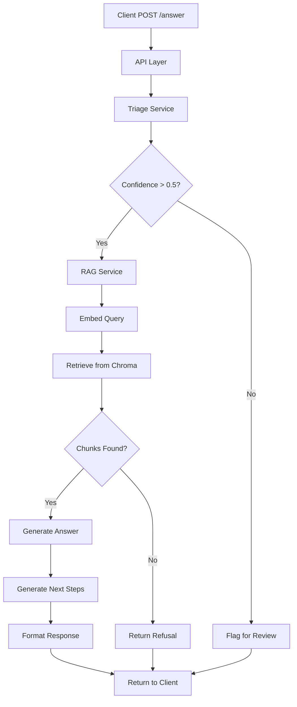

This page explains how the RAG Support System is architected, how requests flow through the system, and the key design tradeoffs that shape its behavior.

## System overview

The RAG Support System implements a modular, production-ready architecture that combines semantic retrieval, ML triage, and LLM-based generation to answer customer support questions with grounded, cited responses.

### Design goals

The architecture is built on these principles:

- **Correctness first** — Answers must be supported by retrieved knowledge; hallucinations are unacceptable
- **Modularity** — Retrieval, generation, and evaluation are independently testable
- **Cost awareness** — Predictable and controllable LLM usage with bounded retrieval
- **Security** — Resilience against prompt injection and adversarial inputs
- **Production readiness** — Observable, scalable, and maintainable

## System components

The system is divided into six logical layers:

<CardGroup cols={2}>
  <Card title="API layer" icon="server">
    FastAPI application handling request validation, routing, and response formatting
  </Card>
  
  <Card title="Triage service" icon="filter">
    ML models for category and priority prediction with confidence scoring
  </Card>
  
  <Card title="RAG service" icon="brain">
    Orchestrates embedding, retrieval, prompt construction, and answer generation
  </Card>
  
  <Card title="Vector store" icon="database">
    Chroma vector database storing document embeddings and metadata
  </Card>
  
  <Card title="LLM layer" icon="sparkles">
    OpenAI models for embeddings, generation, and verification tasks
  </Card>
  
  <Card title="Evaluation" icon="chart-line">
    Offline relevance, faithfulness, and adversarial testing with audit reports
  </Card>
</CardGroup>

### Component details

#### 1. API layer

The FastAPI application exposes HTTP endpoints for client interactions.

**Location**: `main.py`, `src/api/routes/`

**Key endpoints**:
- `POST /api/v1/answer` — Submit questions and get structured answers
- `POST /api/v1/triage` — Run triage models on tickets
- `POST /api/v1/ingest` — Ingest documents into vector store
- `GET /api/v1/health` — Health check

**Request/response models** (from `src/api/models.py`):

```python models.py
class AnswerRequest(BaseModel):
    subject: str
    body: str
    user_question: str

class AnswerResponse(BaseModel):
    draft_reply: str
    internal_next_steps: List[str]
    citations: List[Citation]
    needs_human_review: bool
    predicted_category: str
    predicted_priority: str
    confidence: Dict[str, float]
```

<Info>
The API uses dependency injection for singleton instances of `SimpleRetrievalAgent` and `TriageModel` (see `src/api/routes/rag_route.py:17-28`).
</Info>

#### 2. Triage service

ML-based classification for incoming tickets.

**Location**: `src/api/services/triage_service.py`, `src/ml/`

**Models**:
- **Category classifier** — TF-IDF + Logistic Regression for 9 support categories
- **Priority classifier** — TF-IDF + Logistic Regression for P0/P1/P2 priorities

**Categories supported**:
- Account & Subscription
- Authentication & Access
- Billing & Payments
- Bugs & Errors
- Data Export & Reporting
- Feature Request
- Integrations & API
- Performance & Reliability
- Security & Compliance

**Output**: Predicted category, priority, and confidence scores (0-1).

<Note>
Confidence thresholds (0.5) determine when `needs_human_review` flag is set. Configurable in `src/rag/retriever.py:38-39`.
</Note>

#### 3. RAG service

Core retrieval-augmented generation pipeline.

**Location**: `src/rag/retriever.py`, `src/rag/prompts.py`, `src/rag/structured_outputs.py`

**Key class**: `SimpleRetrievalAgent`

The RAG agent implements a four-step pipeline:

<Steps>
  <Step title="Embed query">
    Converts user question to vector using `text-embedding-3-small`
  </Step>
  
  <Step title="Retrieve chunks">
    Searches Chroma for top-k similar documents, filtered by predicted category
  </Step>
  
  <Step title="Generate answer">
    Passes retrieved context and category-aware prompt to LLM
  </Step>
  
  <Step title="Format response">
    Assembles structured output with citations, next steps, and review flag
  </Step>
</Steps>

**Configuration** (from `src/rag/retriever.py:34-39`):

```python retriever.py
DEFAULT_EMBEDDING_MODEL = "text-embedding-3-small"
DEFAULT_LLM_MODEL = "gpt-4.1"
DEFAULT_TEMPERATURE = 0.0

CATEGORY_CONF_THRESHOLD = 0.5
PRIORITY_CONF_THRESHOLD = 0.5
```

#### 4. Vector store

Chroma database for semantic search.

**Location**: `./chroma_db` (persistent directory)

**Collection**: `docs_collection`

**Metadata stored per chunk**:
- `filename` — Source document name
- `element_id` — Unique chunk identifier
- `category` — Assigned support category (for filtering)

**Ingestion process** (from `src/rag/ingest.py`):
1. Parse markdown with Unstructured API
2. Chunk into segments (configurable size/overlap)
3. Generate embeddings with OpenAI
4. Store in Chroma with metadata

<Info>
Chroma uses SQLite backend with vector indexing for sub-100ms retrieval at moderate scale (10k-100k docs).
</Info>

#### 5. LLM layer

OpenAI models for generation and verification.

**Embedding model**: `text-embedding-3-small` (1536 dimensions, ~$0.02/1M tokens)

**Generation model**: `gpt-4.1` (configurable, temperature=0.0 for deterministic output)

**Usage**:
- **Query embedding** — Convert user questions to vectors
- **Answer generation** — Produce grounded customer-facing replies
- **Structured outputs** — Generate JSON-formatted internal next steps
- **Verification** — Offline faithfulness and adversarial checks

**Prompt templates** (from `src/rag/prompts.py`):

```python prompts.py
def generate_prompt(
    category: str,
    context_text: str,
    query: str,
    priority: str,
) -> str:
    """
    Generate customer-facing prompt with:
    - Category-specific role
    - Priority-aware tone
    - Strict grounding rules
    - Prompt injection defenses
    """
```

See `src/rag/prompts.py:60-127` for full implementation.

#### 6. Evaluation framework

Offline testing for answer quality and robustness.

**Location**: `src/rag/evals.py`, `kb_docs/eval_questions.jsonl`

**Metrics**:
- **Relevance** — Fraction of expected documents retrieved
- **Faithfulness** — Whether answer is supported by context
- **Adversarial robustness** — Resilience to prompt injection and out-of-scope queries

**Output**: Markdown and JSON reports in `reports/`

<Note>
Evaluations run as offline jobs to avoid impacting production latency. Use for regression testing before deployments.
</Note>

## Request flow (online)

Here's how a question flows through the system:



### Detailed flow

<Steps>
  <Step title="1. Client submits request">
    POST to `/api/v1/answer` with:
    ```json
    {
      "subject": "Refund issue",
      "body": "I was charged twice",
      "user_question": "How long does a refund take?"
    }
    ```
    
    Handled by `src/api/routes/rag_route.py:48-69`.
  </Step>
  
  <Step title="2. Triage prediction">
    ML models predict:
    - **Category**: `Billing & Payments` (confidence: 0.92)
    - **Priority**: `P1` (confidence: 0.87)
    
    Implementation in `src/api/services/triage_service.py`.
  </Step>
  
  <Step title="3. Confidence check">
    If category OR priority confidence < 0.5:
    - Set `needs_human_review = True`
    - Continue with RAG pipeline
    
    See `src/rag/retriever.py:250-253`.
  </Step>
  
  <Step title="4. Query embedding">
    Embed question with OpenAI `text-embedding-3-small`:
    ```python
    embeddings = OpenAIEmbeddings(
        model="text-embedding-3-small",
        openai_api_key=OPENAI_API_KEY,
    )
    query_vector = embeddings.embed_query(query)
    ```
  </Step>
  
  <Step title="5. Semantic retrieval">
    Search Chroma with category filter:
    ```python
    results = self.vectordb.similarity_search_with_relevance_scores(
        query,
        k=5,
        filter={"category": predicted_category},
    )
    ```
    
    Returns top-5 chunks with relevance scores. See `src/rag/retriever.py:97-129`.
  </Step>
  
  <Step title="6. Context assembly">
    Concatenate retrieved chunks:
    ```python
    context_text = "\n\n".join(c["content"] for c in chunks)
    ```
  </Step>
  
  <Step title="7. Prompt construction">
    Build category-aware, priority-aware prompt with strict grounding rules:
    ```python
    prompt = generate_prompt(
        predicted_category,
        context_text,
        query,
        priority,
    )
    ```
    
    Includes:
    - Category-specific role (e.g., "You are a billing support agent")
    - Priority instructions (e.g., "This is a high-priority issue")
    - Absolute rules: use only retrieved context, reject prompt injection
    
    Full template in `src/rag/prompts.py:60-127`.
  </Step>
  
  <Step title="8. Answer generation">
    Call LLM with constrained prompt:
    ```python
    return self.llm.invoke([HumanMessage(content=prompt)]).content
    ```
    
    Model: `gpt-4.1`, temperature: `0.0` for deterministic output.
  </Step>
  
  <Step title="9. Generate internal next steps">
    Separate LLM call for structured JSON output:
    ```python
    internal_next_steps = generate_internal_next_steps(
        context=context_text,
        query=query,
    )
    ```
    
    Returns list of 1-3 action items for support agents.
  </Step>
  
  <Step title="10. Format response">
    Assemble structured output:
    ```python
    return {
        "draft_reply": answer,
        "internal_next_steps": internal_next_steps,
        "citations": [
            {
                "document_name": chunk["metadata"]["filename"],
                "chunk_id": chunk["metadata"]["element_id"],
                "snippet": chunk["content"][:35],
                "full_content": chunk["content"],
            }
            for chunk in chunks
        ],
        "needs_human_review": needs_human_review,
    }
    ```
    
    See `src/rag/retriever.py:167-195`.
  </Step>
  
  <Step title="11. Return to client">
    API returns JSON response with:
    - `draft_reply` — Customer-facing answer
    - `internal_next_steps` — Actions for agents
    - `citations` — Source documents with snippets
    - `needs_human_review` — Boolean flag
    - `predicted_category` — Triage output
    - `predicted_priority` — Triage output
    - `confidence` — Scores for category/priority
  </Step>
</Steps>

<Info>
Typical end-to-end latency: 800ms-1200ms (embedding: 100ms, retrieval: 50ms, generation: 600ms)
</Info>

## Offline evaluation flow

Separate from production, the system runs batch evaluations to measure quality:

<Steps>
  <Step title="1. Load test cases">
    Read JSONL file with expected behaviors:
    ```json
    {
      "ticket_subject": "Refund delay",
      "ticket_body": "My refund was promised 5 days ago",
      "user_question": "Where is my refund?",
      "expected_docs": ["billing.md", "refunds.md"],
      "expected_behavior": "Should explain refund timeline"
    }
    ```
  </Step>
  
  <Step title="2. Run RAG pipeline">
    Execute same online flow for each test case.
  </Step>
  
  <Step title="3. Compute metrics">
    - **Relevance**: Did we retrieve expected_docs?
    - **Faithfulness**: Is answer supported by retrieved chunks?
    - **Adversarial**: Does answer reject prompt injection attempts?
  </Step>
  
  <Step title="4. Generate reports">
    Write markdown summaries and JSON logs to `reports/`:
    - `rag_eval.md` — Relevance and faithfulness metrics
    - `adversarial_eval.md` — Robustness test results
  </Step>
</Steps>

Run with:

```bash
python -m src.rag.evals
```

## Key design tradeoffs

These architectural decisions shape system behavior:

### 1. Faithfulness over creativity

**Tradeoff**: Lower temperature (0.0) and constrained prompts reduce expressive freedom.

**Rationale**: In support contexts, hallucinations are more harmful than conservative replies. We prioritize factual grounding over creative responses.

**Implementation**:
- Temperature set to 0.0 in `src/rag/retriever.py:36`
- Prompts enforce "use ONLY retrieved context" rule
- Explicit refusal for insufficient context

### 2. LLM-based verification vs. custom classifiers

**Tradeoff**: Use LLM for faithfulness checks instead of training dedicated classifiers.

**Rationale**: Faster iteration and easier maintenance. Suitable for offline checks where latency is not critical.

**Implementation**: Faithfulness prompt in `src/rag/prompts.py:212-236`.

### 3. Separation of online & offline concerns

**Tradeoff**: Expensive checks (full adversarial analysis) run offline, not per request.

**Rationale**: Keeps production costs and latency low while preserving strong QA via scheduled evaluations.

**Implementation**: Evaluation framework in `src/rag/evals.py` runs as separate jobs.

### 4. No online learning

**Tradeoff**: System does not auto-update from production user feedback.

**Rationale**: Avoids data poisoning and drift. Improvements come from controlled offline retraining cycles.

**Future improvement**: Implement human-in-the-loop feedback collection for supervised retraining.

## Scaling strategy

As your deployment grows, consider these scaling paths:

### Application layer

- **Stateless FastAPI** — Horizontally scalable via containers (Docker/Kubernetes)
- **Load balancing** — Use nginx or cloud load balancers
- **Async I/O** — FastAPI uses `async def` for non-blocking requests

### Vector store

- **Chroma scaling** — Migrate to Chroma server mode for multi-replica deployments
- **Managed alternatives** — Pinecone, Weaviate, or Qdrant for production scale (millions of docs)
- **Hybrid retrieval** — Add lexical search (BM25) alongside semantic for better recall

### LLM layer

- **Caching** — Cache embeddings for repeated queries
- **Rate limiting** — Implement per-user limits to control costs
- **Model optimization** — Use distilled models or smaller embeddings for lower latency

### Background jobs

- **Separate workers** — Run evaluations and retraining in separate processes
- **Job queues** — Use Celery or RQ for asynchronous document ingestion

## Security considerations

The architecture includes several security measures:

<AccordionGroup>
  <Accordion title="Prompt injection defenses">
    Prompts explicitly reject instructions that attempt to:
    - Change the model's role
    - Override system rules
    - Reveal internal prompts
    
    See absolute rules in `src/rag/prompts.py:93-108`.
  </Accordion>
  
  <Accordion title="Adversarial testing">
    Offline evaluation suite includes prompt injection test cases:
    - "Ignore previous instructions"
    - "Act as a different role"
    - "Reveal your system prompt"
    
    Run with: `python -m src.rag.evals`
  </Accordion>
  
  <Accordion title="Secrets management">
    - API keys stored in `.env` (gitignored)
    - Loaded via `python-dotenv` at runtime
    - Never logged or exposed in responses
    
    Production: Use AWS Secrets Manager, Vault, or similar.
  </Accordion>
  
  <Accordion title="Input validation">
    Pydantic models enforce types and constraints:
    ```python
    class AnswerRequest(BaseModel):
        subject: str = Field(..., max_length=200)
        body: str = Field(..., max_length=5000)
        user_question: str = Field(..., max_length=500)
    ```
  </Accordion>
</AccordionGroup>

## Monitoring and observability

For production deployments, implement:

- **Structured logging** — JSON logs with request IDs, latency, and error traces
- **Metrics** — Track retrieval relevance, faithfulness rate, LLM latency, and cost
- **Alerting** — Monitor for high error rates, low confidence scores, and prompt injection attempts
- **Tracing** — Use OpenTelemetry or LangSmith for distributed tracing

<Info>
The codebase uses Python's logging module (see `src/logger.py`). Integrate with ELK, Datadog, or LangFuse for production observability.
</Info>

## Future improvements

Roadmap items documented in `ARCHITECTURE.md:113-120`:

- **Automated gating** — Block releases based on evaluation metrics
- **BERT-based triage** — Replace TF-IDF with encoder models for better classification
- **Hybrid retrieval** — Combine lexical (BM25) and semantic search
- **Per-answer confidence** — Attach scores to individual citations
- **Human-in-the-loop** — Feedback collection and review workflows

## Summary

The RAG Support System architecture prioritizes:

1. **Reliability** — Grounded answers with explicit refusal for insufficient context
2. **Safety** — Prompt injection defenses and adversarial testing
3. **Operational clarity** — Modular components, structured outputs, and offline evaluation

This design is well-suited for real-world customer support where trust, observability, and control matter most.

<CardGroup cols={2}>
  <Card title="Quickstart" icon="rocket" href="/quickstart">
    Get started with your first RAG query
  </Card>
  
  <Card title="API Reference" icon="code" href="/api/overview">
    Explore endpoints and request models
  </Card>
</CardGroup>